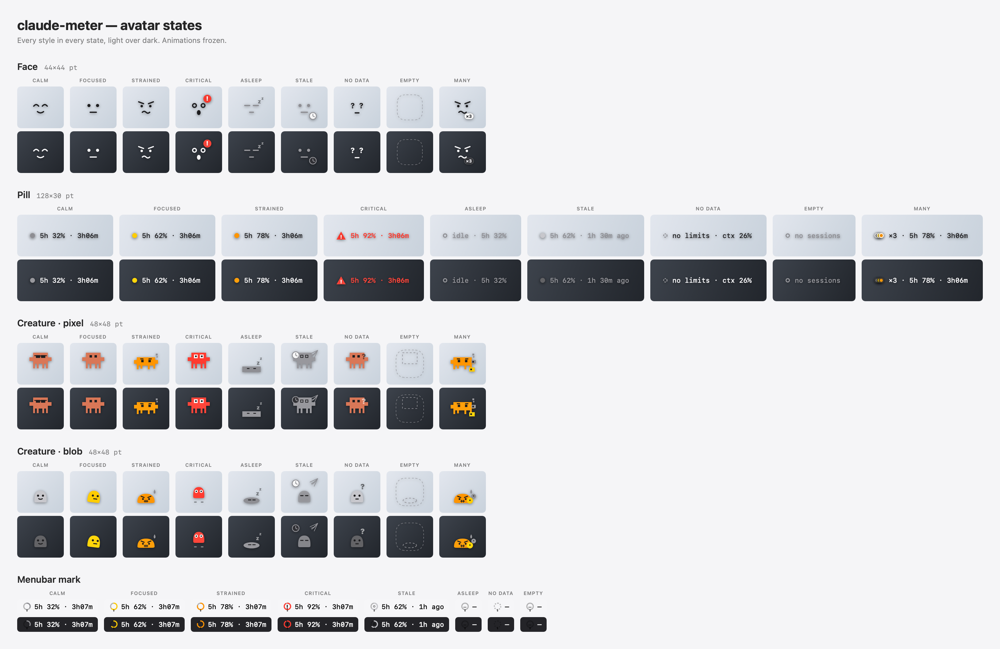
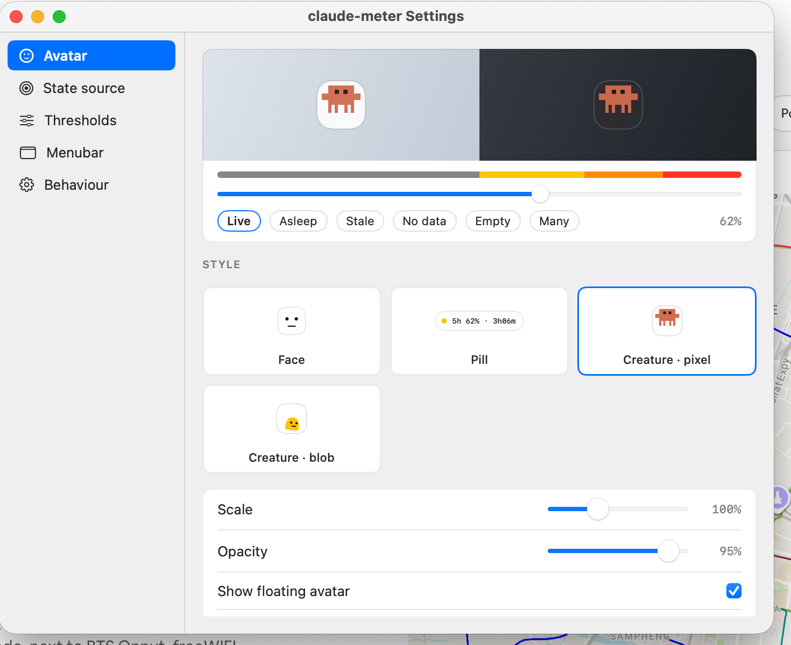

# claude-meter

See your Claude Code 5-hour limit, weekly limit, and per-session context fill
without opening claude.ai.

A menubar item plus a floating avatar, fed by a collector that hangs off Claude
Code's status line.

```
menubar:   5h 41%

avatar:    ╭───────╮
           │  ◕‿◕  │   5h  41%
           ╰───────╯   ctx 22%

status line (below the kickbacks ad):
           5h 41% ·3h07m   7d 15%   ctx 22% 225k/1M   $8.34
```

## Why it works this way

Claude Code delivers `rate_limits` (the 5-hour and 7-day windows) and
`context_window` to exactly one place: the **statusLine command's stdin**.
There is no local API, log, or file that carries the 5-hour number — the status
line is the only channel. So `bin/claude-meter-collect` runs as a status line
command and publishes what it receives; everything else reads those snapshots.

Two consequences worth knowing:

- **Nothing updates while no session is running.** The status line only fires on
  session start, new assistant messages, `/compact`, and permission/vim mode
  changes. With no session open there is no new data, so the avatar sleeps and
  shows the age of what it last saw rather than pretending a stale number is
  current.
- **`rate_limits` needs a Claude.ai subscription and one API response.** It is
  absent for Console billing, and absent in a brand new session until the first
  reply comes back. The UI shows "no limit data yet" rather than 0%.

For an authoritative on-demand check inside a session, `/usage` (alias `/cost`)
and `/context` are built in.

## Layout

| Path | What it does |
|---|---|
| `bin/claude-meter-collect` | Status line command. Publishes a snapshot per session and prints the HUD line. |
| `bin/claude-meter-session-end` | `SessionEnd` hook. Deletes the snapshot so the avatar knows the session closed. |
| `bin/claude-meter-session-start` | `SessionStart` hook. Re-asserts the status line chain if something clobbered it. |
| `Sources/ClaudeMeter/` | The menubar app and floating avatar. |
| `scripts/build-app.sh` | Builds `dist/ClaudeMeter.app`. |
| `scripts/selftest.sh` | Headless tests for the store, moods, liveness, and malformed input. |
| `install.sh` | Does all of the wiring below. Idempotent. |

Snapshots live outside the repo, in `~/.local/state/claude-meter/`:

- `sessions/<session_id>.json` — one per session, rewritten on every status line refresh
- `last-raw.json` — the most recent raw status line payload, kept for debugging schema changes

## Install

```bash
./install.sh
```

That builds the app, chains the collector into the status line, adds the two
Claude Code hooks, and loads the `com.momentumminds.claude-meter` LaunchAgent.

### The status line chain

`~/.claude/settings.json`'s `statusLine` belongs to the kickbacks ad script,
which rewrites it. Rather than fight that, claude-meter uses the chain hook
kickbacks already provides: it runs whatever command is named in
`~/.kickbacks/cli-prev-statusline.json` and stacks that output on the lines
below the ad. So the install writes:

```json
{"statusLine":{"type":"command","command":"/absolute/path/to/claude-meter/bin/claude-meter-collect"}}
```

The kickbacks installer has overwritten that file before, which would make the
HUD vanish silently. The `SessionStart` hook re-asserts it every session.

Without kickbacks, point `statusLine.command` straight at
`bin/claude-meter-collect` instead.

## Reading the avatar



Four styles, switchable in Settings:

| Style | Size | For |
|---|---|---|
| **Face** | 44×44 | A companion, not an instrument. Learn the expressions once and stop reading numbers. |
| **Pill** | 128×30, grows | Maximum truth per pixel: worst metric, its number, its deadline, in one row. |
| **Creature · pixel** | 48×48 | A blocky quadruped whose stance carries the state. Native next to a monospace prompt. |
| **Creature · blob** | 48×48 | The soft-bodied original. Same pose grammar: works, sweats, panics, sleeps. |

By default the state reflects `max(5h%, 7d%, worst live session context%)` — any
one of the three filling up is worth reacting to. Settings can narrow that to
the 5-hour window or context alone.

| State | Trigger |
|---|---|
| Calm | under 50% |
| Focused | 50–70% |
| Strained | 70–85% |
| Critical | 85% and up — the only state that animates |
| Asleep | no session active in the last 5 minutes |
| Stale | data over an hour old |
| No data | rate limits have never arrived |
| Empty | no sessions at all |

The floating avatar shows the character alone by default — no plate behind it,
just a drop shadow that follows the silhouette. A plate is available in Settings
for busy wallpaper; the styles draw one either way for the `empty` state, where
a dashed outline is the entire message.

Thresholds are editable. Critical is never colour alone — each style adds a
geometric cue (badge, warning triangle, airborne pose, ring), so escalation
survives colour-vision deficiency and greyscale. Animation respects the system
Reduce Motion setting, and every animated state has a legible still frame.

Absence is never drawn as zero: a missing metric gets a dashed track, hollow
ring, or question-mark eyes. Stale data keeps its last value but drains to grey
and carries a clock, and countdowns are replaced by an age — a countdown implies
the number beside it is live.

Left-click the menubar item for the full breakdown: both account windows with
reset countdowns, then every session with its own context bar, token count, and
cost. Past four sessions the rest collapse into one row that still surfaces the
worst context fill. Right-click for show/hide avatar, reset position, Settings,
reveal snapshots, and quit.

Drag the avatar anywhere; its position is remembered, and it is placed back on
screen automatically if the display it was on goes away.

## Settings



Five panes — Avatar, State source, Thresholds, Menubar, Behaviour — with a live
preview pinned above all of them, because thresholds and the state source change
what the avatar shows and a preview you have to navigate back to is a preview
nobody uses. The sweep slider drags the selected style through the whole
escalation, and the chips force the states you cannot reach on demand: asleep,
stale, no data, empty, many sessions.

Thresholds re-order themselves rather than refusing an edit — raising Focused
past Strained pushes Strained up — and the preview strip re-colours its track to
the edited boundaries immediately.

### Reviewing it without clicking

```bash
# every style in every state, light over dark
ClaudeMeter --render-grid states.png

# the popover at none / three / ten sessions
ClaudeMeter --render-ui ui.png

# the real settings window, for a screenshot
ClaudeMeter --open-settings --settings-pane thresholds
```

The two render modes draw offscreen through `ImageRenderer`, so they need no
screen-recording permission. They cannot draw `ScrollView` content or
AppKit-backed controls, so the settings panes need the real window.

## Uninstall

```bash
launchctl bootout "gui/$UID/com.momentumminds.claude-meter"
rm ~/Library/LaunchAgents/com.momentumminds.claude-meter.plist
rm ~/.kickbacks/cli-prev-statusline.json     # drops the HUD line
rm -rf ~/.local/state/claude-meter
```

Then remove the `hooks.SessionStart` / `hooks.SessionEnd` entries from
`~/.claude/settings.json`.

## License

Copyright © 2026 Momentum Minds LLC. All rights reserved.

Source-available, not open source. You may use, modify, and redistribute it
freely, but you **may not sell it** or include it in anything sold. See
[LICENSE](LICENSE) for the full terms.

Not affiliated with or endorsed by Anthropic. "Claude" and "Claude Code" are
trademarks of Anthropic, PBC.
